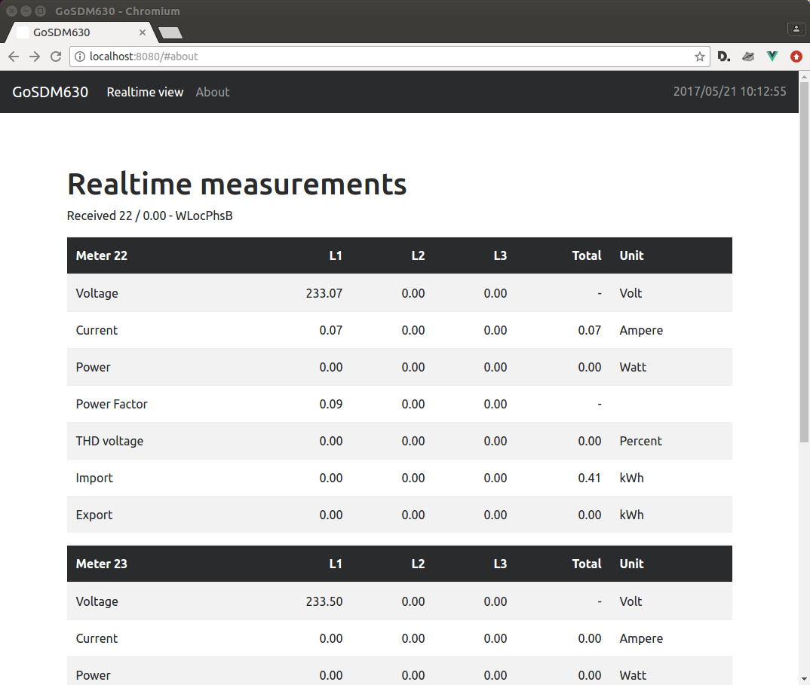

# ModBus Measurement Daemon

[](https://travis-ci.org/volkszaehler/mbmd)

A daemon for collecting measurement data from smart meters and grid inverters over modbus.

`mbmd` provides an http interface to smart meters and grid inverters with modbus interface.
Meter readings are made accessible through REST API and MQTT.
Modbus communication is possible over RS485 connections as well as TCP sockets.

`mbmd` was originally developer by Mathias Dalheimer under the name of `gosdm`. Previous releases are still [available](https://github.com/gonium/gosdm630).

# Table of Contents

* [Requirements](#requirements)
* [Installation](#installation)
  * [Raspberry Pi](#raspberry-pi)
  * [Detecting connected meters](#detecting-connected-meters)
* [API](#api)
  * [Rest API](#rest-api)
  * [Websocket API](#websocket-api)
  * [MQTT API](#mqtt-api)
* [Supported Devices](#supported-devices)
* [Changelog](#changelog)


## Requirements

You'll need:
* A supported Modbus/RTU smart meter OR an supported Modbus/TCP SunSpec-compatible grid inverter.
* In case of Modbus/RTU: A USB RS485 adapter. See [USB-ISO-RS485 project](https://github.com/gonium/usb-iso-rs485) for a home-grown adapter.


## Installation

### Using the precompiled binaries

Precompiled release packages are [available](https://github.com/volkszaehler/mbmd/releases). Download the right package for the target platform and unzip.

### Building from source

`mbmd` is developed in [Go](http://golang.org) and requires >1.11. To build from source use `make build` which creates `./mbmd`.

To cross-build for a different archtecture (e.g. Raspberry Pi), use

    GOOS=linux GOARCH=arm GOARM=5 make build

### Using Docker

Docker images are provided as well:

	docker run -p 8080:8080 --device=/dev/ttyUSB0 volkszaehler/mbmd -a /dev/ttyUSB0 -u 0.0.0.0:8080 -d sdm:1

### Running

To get help on the various command line options run

	mbmd -h

A typical invocation looks like this:

    $ ./bin/mbmd -a /dev/ttyUSB0 -d janitza:26,sdm:1
    2017/01/25 16:34:26 Connecting to RTU via /dev/ttyUSB0
    2017/01/25 16:34:26 Starting API at :8080

This call queries a Janitza B23 meter with ID 26 and an Eastron SDM
meter at ID 1. Not all devices are by default configured to use ID 1.
The default device IDs depend on the meter type and documented in the meter's manual.

If you use the ``-v`` commandline switch you can see
modbus traffic and the current readings on the command line.  At
[http://localhost:8080](http://localhost:8080) you can see an embedded
web page that updates itself with the latest values:




## Raspberry Pi

Download the ARM package for usage with Raspberry Pi and copy the binary
into `/usr/local/bin`. The following sytemd unit can be used to
start `mbmd` as service (put this into ``/etc/systemd/system``):

    [Unit]
    Description=mbmd
    After=syslog.target
    [Service]
    ExecStart=/usr/local/bin/mbmd -d /dev/ttyAMA0
    Restart=always
    [Install]
    WantedBy=multi-user.target

You might need to adjust the ``-s`` parameter depending on where your
RS485 adapter is connected. Then, use

    systemctl start mbmd

to test your installation. If you're satisfied use

    systemctl enable mbmd

to start the service at boot time automatically.

*WARNING:* When using an FTDI-based USB-RS485 adaptor the
Raspberry Pi might become unreachable after a while. This is most likely not
an issue with the RS485-USB adaptor or this software, but because of [a
bug in the Raspberry Pi kernel](https://github.com/raspberrypi/linux/issues/1187).
To fix switch the internal `dwc` USB hub of the Raspberry Pi to
USB1.1 by adding the following parameter to `/boot/cmdline.txt`:

    dwc_otg.speed=1


## Detecting connected meters

MODBUS/RTU does not provide a mechanism to discover devices. There is no
reliable way to detect all attached devices.
As workaround `mbmd -detect` attempts to read the L1 voltage from all
device IDs and reports which one replied correctly:

````
./mbmd -detect
2017/06/21 10:22:34 Starting bus scan
2017/06/21 10:22:35 Device 1: n/a
...
2017/07/27 16:16:39 Device 21: SDM type device found, L1 voltage: 234.86
2017/07/27 16:16:40 Device 22: n/a
2017/07/27 16:16:40 Device 23: n/a
2017/07/27 16:16:40 Device 24: n/a
2017/07/27 16:16:40 Device 25: n/a
2017/07/27 16:16:40 Device 26: Janitza type device found, L1 voltage: 235.10
...
2017/07/27 16:17:25 Device 247: n/a
2017/07/27 16:17:25 Found 2 active devices:
2017/07/27 16:17:25 * slave address 21: type SDM
2017/07/27 16:17:25 * slave address 26: type JANITZA
2017/07/27 16:17:25 WARNING: This lists only the devices that responded to a known L1 voltage request. Devices with different function code definitions might not be detected.
````


# API

## Rest API

`mbmd` provides a convenient REST API. Supported endpoints under `/api` are:

* `/last/{ID}` latest data for device
* `/minuteavg/{ID}` averaged data over last minute
* `/status` daemon status

Both device APIs can also be called without the device id to return data for all connected devices.


### Monitoring

The `/status` endpoint provides the following information:

    $ curl http://localhost:8080/status
    {
      "StartTime": "2017-01-25T16:35:50.839829945+01:00",
      "UpTime": 65587.177092186,
      "Goroutines": 11,
      "Memory": {
        "Alloc": 1568344,
        "HeapAlloc": 1568344
      },
      "Modbus": {
        "TotalModbusRequests": 1979122,
        "ModbusRequestRatePerMinute": 1810.5264666764785,
        "TotalModbusErrors": 738,
        "ModbusErrorRatePerMinute": 0.6751319688261972
      },
      "ConfiguredMeters": [
        {
          "Id": 26,
          "Type": "JANITZA",
          "Status": "available"
        }
      ]
    }

This is a snapshot of a process running over night, along with the error
statistics during that timeframe. The process queries continuously,
the cabling is not a shielded, twisted wire but something that I had laying
around. With proper cabling the error rate should be lower, though.


## Websocket API

Data read from the meters can be observed by clients in realtime using the Websocket API. As soon as new readings are available, they are pushed to connected websocket clients.

The websocket API is available on `/ws`. All connected clients receive status and
meter updates for all connected meters without further subscription.


## MQTT API

Another option for receiving client updates is by using the built-in MQTT publisher.
By default, readings are published at `/mbmd/<unique id>/<reading>`. Rate limiting is possible.


# Supported Devices

`mbmd` supports a range of DIN rail meters and grid inverters.

## Modbus RTU Meters

The meters have slightly different capabilities. The EASTRON SDM630 offers
a lot of features, while the smaller devices only support basic
features.  The table below gives an overview (please consult the
manuals for definitive guidance):

| Meter | Phases | Voltage | Current | Power | Power Factor | Total Import | Total Export | Per-phase Import/Export | Line/Neutral THD |
|---|---|---|---|---|---|---|---|---|---|
| SDM120/220 | 1 | + | + | + | + | + | + | - | - |
| SDM530 | 3 | + | + | + | + | + | + | - | - |
| SDM630 | 3 | + | + | + | + | + | + | + | + |
| Janitza B23-312 | 3 | + | + | + | + | + | + | - | - |
| DZG DVH4013 | 3 | + | + | - | - | + | + | - | - |
| SBC ALE3 | 3 | + | + | + | + | + | + | - | - |
| ABB A/B-Series | 3 | + | + | + | + | + | + | + | + |

 * SDM120: Cheap and small (1TE), but communication parameters can only be set over MODBUS, which is currently not supported by this project. You can use e.g.
 [SDM120C](https://github.com/gianfrdp/SDM120C) to change parameters.
 * SDM220, SDM230: More comfortable (2TE), can be configured using the builtin display and
 button.
 * SDM530: Very big (7TE) - takes up a lot of space, but all connections are
 on the underside of the meter.
 * SDM630 v1 and v2, both MID and non-MID. Compact (4TE) and with lots
 of features. Can be configured for 1P2 (single phase with neutral), 3P3
 (three phase without neutral) and 3P4 (three phase with neutral) systems.
 * Janitza B23-312: These meters have a higher update rate than the Eastron
 devices, but they are more expensive. The -312 variant is the one with a MODBUS interface.
 * DZG DVH4013: This meter does not provide raw phase power measurements
 and only aggregated import/export measurements. The meter is only
 partially implemented and not recommended. If you want to use it: By
 default, the meter communicates using 9600 8E1 (comset 5). The meter ID
 is derived from the serial number: take the last two numbers of the
 serial number (top right of the device), e.g. 23, and add one (24).
 Assume this is a hexadecimal number and convert it to decimal (36). Use
 this as the meter ID.
 * SBC ALE3: This compact Saia Burgess Controls meter is comparable to the SDM630:
 two tariffs, both import and export depending on meter version and compact (4TE).
 It's often used with Viessmann heat pumps.

 ## Modbus TCP Grid Inverters

 Apart from meters, SunSpec-compatible grid inverters connected over TCP
 are supported, too. SunSpec defines a default register layout for accessing
 the devices.

 Supported inverters include popular devices from SolarEdge (SE3000, SE9000)
 and SMA (Sunny Boy and Sunny Tripower).

 In case of TCP connection, the adapter paramter becomes the hostname and port:

	./mbmd -a 192.168.0.44:502 -d SMA:23


# Changelog

## 0.8 (unreleased)

Initial release at https://github.com/volkszaehler/mbmd

## 0.7

Before versoin 0.8, `mbmd` was known as `sdm630` and developed by Mathias Dalheimer. Older releases of `mbmd`/`sdm630` can be found at https://github.com/gonium/gosdm630
