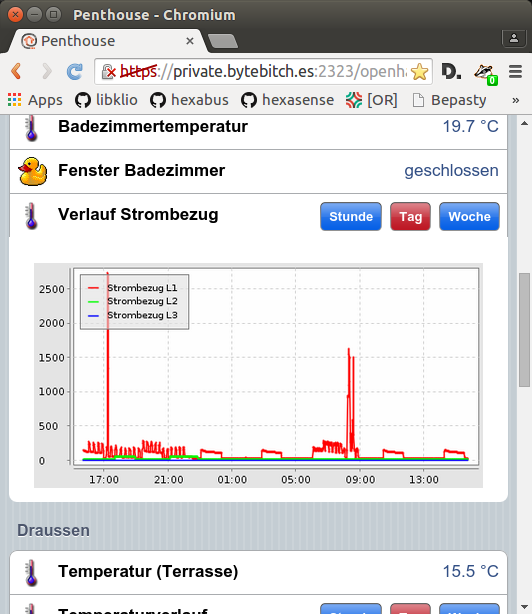
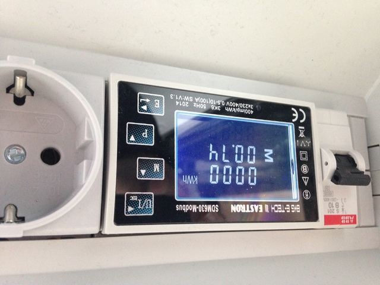
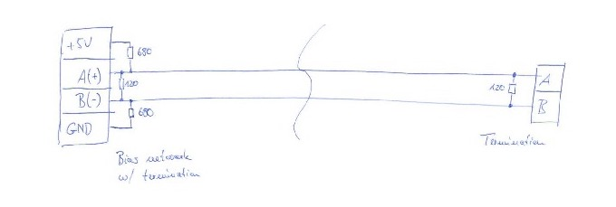
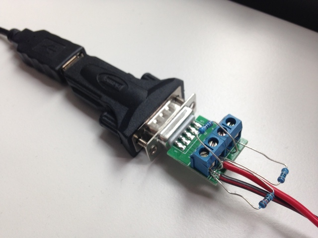

# A HTTP interface to MODBUS smart meters

This project provides a http interface to smart
meters with a MODBUS interface. Beside the EASTRON SDM series, the
software also supports the Janitza B23 DIN-rail meters. The meters
provide all measured values over an RS485 connection. The software reads
the measurements and wraps them into a HTTP interface, making it very
easy to integrate it into your home automation system. Both a REST-style
API and a streaming API are available.

## Suported Devices:

The meters have slightly different capabilities. The EASTRON SDM630 offers
a lot of features, while the smaller devices only support basic
features.  This table gives you an overview (please note: check the
manuals for yourself, I could be wrong):

| Meter | Phases | Voltage | Current | Power | Power Factor | Total Import | Total Export | Per-phase Import/Export | Line/Neutral THD |
|---|---|---|---|---|---|---|---|---|---|
| SDM120 | 1 | + | + | + | + | + | + | - | - |
| SDM220 | 1 | + | + | + | + | + | + | - | - |
| SDM220 | 1 | + | + | + | + | + | + | - | - |
| SDM530 | 3 | + | + | + | + | + | + | - | - |
| SDM630 v1 | 3 | + | + | + | + | + | + | + | + |
| SDM630 v2 | 3 | + | + | + | + | + | + | + | + |
| Janitza B23 | 3 | + | + | + | + | + | + | - | - |

Please note that voltage, current, power and power factor are always
reported for each connected phase.

 * SDM120: Cheap and small (1TE), but communication parameters can only be set over MODBUS,
		 which is currently not supported by this project. You can use e.g.
		 [SDM120C](https://github.com/gianfrdp/SDM120C) to change parameters.
 * SDM220, SDM230: More comfortable (2TE), can be configured using the builtin display and
 button.
 * SDM530: Very big (7TE) - takes up a lot of space, but all connections are
 on the underside of the meter.
 * SDM630 v1 and v2, both MID and non-MID. Compact (4TE) and with lots
 of features. Can be configured for 1P2 (single phase with neutral), 3P3
 (three phase without neutral) and 3P4 (three phase with neutral)
	systems.
 * Janitza B23: These meters have a higher update rate than the Eastron
 devices, but they are more expensive.

Some of my test devices have been provided by [B+G
E-Tech](http://bg-etech.de/) - please consider to buy your meter from
them!

# Table of Contents:

  * [How does it look like in OpenHAB?](#how-does-it-look-like-in-openhab)
  * [Installation](#installation)
    * [Hardware installation](#hardware-installation)
    * [Installing the software from source](#installing-the-software-from-source)
    * [Testing](#testing)
    * [Installation on the Raspberry Pi](#installation-on-the-raspberry-pi)
  * [The API](#the-api)
  * [Monitoring](#monitoring)
  * [OpenHAB integration](#openhab-integration)


## How does it look like in OpenHAB?

I use [OpenHAB 1.8](http://openhab.org) to record various measurements at
home. In the classic ui, this is how one of the graphs looks like:



Everything is in German, but the "Verlauf Strombezug" graph shows my
power consumption for three phases. I have a SDM630 installed in my
distribution cabinet. A serial connection links it to a Raspberry Pi
(RPi).
This is where this piece of software runs and exposes the measurements
via a RESTful API. OpenHAB connects to it and stores the values, just as
it does with other sensors in my home.

## Installation

The installation consists of a hardware and a software part.
Make sure you buy/fetch the following things before starting:

* A supported Modbus/RTU smart meter.
* A USB RS485 adaptor. I use a homegrown one, please see [my
USB-ISO-RS485 project](https://github.com/gonium/usb-iso-rs485)
* Some cables to connect the adapter to the SDM630 (for testing, I use
an old speaker cable I had sitting on my workbench, for the permanent
installation, a shielded CAT5 cable seems adequate)

### Hardware installation



First, you should integrate the meter into your fuse box. Please ask a
professional to do this for you - I don't want you to hurt yourself!
Refer to the meter installation manual on how to do this. You need to
set the MODBUS communication parameters to ``9600 8N1``. 
After this you need to connect a RS485 adaptor to the meter. This is
how I did the wiring:



You can try to use a cheap USB-RS485 adaptor, or you can [build your own
isolated adaptor](https://github.com/gonium/usb-iso-rs485). I did my
first experiments with a [Digitus USB-RS485
adaptor](http://www.digitus.info/en/products/accessories/adapter-and-converter/r-usb-serial-adapter-usb-20-da-70157/)
which comes with a handy terminal block. I mounted the [bias
network](https://en.wikipedia.org/wiki/RS-485) directly on the terminal
block:



Since then, I tested various adaptors:

* Supercheap adaptors from China: No ground connection, one worked fine,
	another one was unstable
* Industrial adaptors like the [Meilhaus RedCOM
USB-COMi-SI](https://www.meilhaus.de/usb-comi-si.htm) or the [ADAM
4561](http://www.advantech.com/products/gf-5u7m/adam-4561/mod_92dc04b1-c0fe-4f2b-baf6-5c27e79900c6)
isolate the RS-485 bus from the USB line and work extremely reliable.
But they are really expensive.

I started to develop [my own isolated
adaptor](https://github.com/gonium/usb-iso-rs485). Please check this
link for more information.

### Using the precompiled binaries

You can use the [precompiled releases](https://github.com/gonium/gosdm630/releases) if you like. Just
download the right binary for your platform and unzip.

### Installing the software from source

You need a working [Golang installation](http://golang.org), the [GB
build tool](http://getgb.io/) and
[Embed](http://github.com/aprice/embed) in order to compile your binary.
Please install the Go compiler first. Then clone this repository:

    git clone https://github.com/gonium/gosdm630.git

If you have ``make`` installed you can
use the ``Makefile`` to install the ``gb`` and ``embed`` tools:

    $ cd gosdm630
    $ make dep
    Installing GB build tool
    Installing embed tool

Or, if you prefer to install it manually, just run 

    $ go get github.com/constabulary/gb/...
    $ go get github.com/aprice/embed/cmd/embed

You can then build the software using the ``Makefile``:

    $ make
    Generating embedded assets
    Generation complete in 109.907612ms
    Building for host platform
    github.com/gonium/gosdm630
    github.com/gonium/gosdm630/cmd/sdm_detect
    github.com/gonium/gosdm630/cmd/sdm630_httpd
    github.com/gonium/gosdm630/cmd/sdm630_monitor
    github.com/gonium/gosdm630/cmd/sdm630_logger
    Building binary for Raspberry Pi
    github.com/gonium/gosdm630
    github.com/gonium/gosdm630/cmd/sdm_detect
    github.com/gonium/gosdm630/cmd/sdm630_monitor
    github.com/gonium/gosdm630/cmd/sdm630_httpd
    github.com/gonium/gosdm630/cmd/sdm630_logger
    Created binaries:
    sdm630_httpd
    sdm630_httpd-linux-arm
    sdm630_logger
    sdm630_logger-linux-arm
    sdm630_monitor
    sdm630_monitor-linux-arm
    sdm_detect
    sdm_detect-linux-arm

As you can see two sets of binaries are built:

 * ``bin/sdm630_{...}`` is the software built for the host platform
 * ``bin/sdm630_{...}-linux-arm`` is the same for the Raspberry Pi.

If you prefer to build manually you can build the host software using

    gb build all

or, for the Raspberry Pi binary, use

    GOOS=linux GOARCH=arm GOARM=5 gb build all

### Testing

Now fire up the software:

    $ ./bin/sdm630_httpd --help
    NAME:
       sdm630_httpd - SDM630 power measurements via HTTP.
    
    USAGE:
       sdm630_httpd [global options] command [command options] [arguments...]
    
    COMMANDS:
         help, h  Shows a list of commands or help for one command
    
    GLOBAL OPTIONS:
       --serialadapter value, -s value  path to serial RTU device (default: "/dev/ttyUSB0")
       --url value, -u value            the URL the server should respond on (default: ":8080")
       --verbose, -v                    print verbose messages
       --device_list value, -d value    MODBUS device ID to query (default: "SDM:1")
       --help, -h                       show help
    

A typical invocation looks like this:

		$ ./bin/sdm630_httpd -s /dev/ttyUSB0 -d janitza:26,sdm:1
    2017/01/25 16:34:26 Connecting to RTU via /dev/ttyUSB0
    2017/01/25 16:34:26 Starting API httpd at :8080

This call queries a Janitza B23 meter with ID 26 and an Eastron SDM
meter at ID 1. It . If you use the ``-v`` commandline switch you can see
modbus traffic and the current readings on the command line.  At
[http://localhost:8080](http://localhost:8080) you can see an embedded
web page that updates itself with the latest values:


### Installation on the Raspberry Pi

You simply copy the binary from the ``bin`` subdirectory to the RPi
and start it. I usually put the binary into ``/usr/local/bin`` and
rename it to ``sdm630_httpd``. The following sytemd unit can be used to
start the service (put this into ``/etc/systemd/system``):

    [Unit]
    Description=SDM630 via HTTP API
    After=syslog.target
    [Service]
    ExecStart=/usr/local/bin/sdm630_httpd -s /dev/ttyAMA0
    Restart=always
    [Install]
    WantedBy=multi-user.target

You might need to adjust the ``-s`` parameter depending on where your
RS485 adapter is connected. Then, use

    # systemctl start sdm630

to test your installation. If you're satisfied use

    # systemctl enable sdm630

to start the service at boot time automatically.

*WARNING:* If you use an FTDI-based USB-RS485 adaptor you might see the
Raspberry Pi becoming unreachable after a while. This is most likely not
an issue with your RS485-USB adaptor or this software, but because of [a
bug in the Raspberry Pi kernel](https://github.com/raspberrypi/linux/issues/1187).
As mentioned there, add the following parameter to your
``/boot/cmdline.txt``:

    dwc_otg.speed=1

This switches the internal ``dwc`` USB hub of the Raspberry Pi to
USB1.1. While this reduces the available USB speed, the device now works
reliably.

## The REST API

As of version 0.2 the software supports more than one device. In order
to query the API you need to provide the MODBUS ID of the device you
want to query.

The API consists of calls that return a JSON datastructure. The "GET
/last/{ID}"-call simply returns the last measurements of the device with
the Modbus ID {ID}:

````
$ curl localhost:8080/last/11
{
  "Timestamp": "2017-03-27T15:15:09.243729874+02:00",
  "Unix": 1490620509,
  "ModbusDeviceId": 11,
  "Power": {
    "L1": 0,
    "L2": -45.28234100341797,
    "L3": 0
  },
  "Voltage": {
    "L1": 233.1257781982422,
    "L2": 233.12904357910156,
    "L3": 0
  },
  "Current": {
    "L1": 0,
    "L2": 0.19502629339694977,
    "L3": 0
  },
  "Cosphi": {
    "L1": 1,
    "L2": -0.9995147585868835,
    "L3": 1
  },
  "Import": {
    "L1": 0.16599999368190765,
    "L2": 0.10999999940395355,
    "L3": 0.0010000000474974513
  },
  "TotalImport": 0.2770000100135803,
  "Export": {
    "L1": 0,
    "L2": 0.3019999861717224,
    "L3": 0
  },
  "TotalExport": 0.3019999861717224,
  "THD": {
    "VoltageNeutral": {
      "L1": 0,
      "L2": 0,
      "L3": 0
    },
    "AvgVoltageNeutral": 0
  }
}
````

The "GET /minuteavg"-call returns the average measurements over the last
minute:

````
$ curl localhost:8080/minuteavg/11
{
  "Timestamp": "2017-03-27T15:19:06.470316939+02:00",
  "Unix": 1490620746,
  "ModbusDeviceId": 11,
  "Power": {
    "L1": 0,
    "L2": -45.333974165794174,
    "L3": 0
  },
  "Voltage": {
    "L1": 233.06608112041766,
    "L2": 233.0702075958252,
    "L3": 0
  },
  "Current": {
    "L1": 0,
    "L2": 0.19468470108814728,
    "L3": 0
  },
  "Cosphi": {
    "L1": 1,
    "L2": -0.9989471855836037,
    "L3": 1
  },
  "Import": {
    "L1": 0,
    "L2": 0,
    "L3": 0
  },
  "TotalImport": 0,
  "Export": {
    "L1": 0,
    "L2": 0,
    "L3": 0
  },
  "TotalExport": 0,
  "THD": {
    "VoltageNeutral": {
      "L1": 0,
      "L2": 0,
      "L3": 0
    },
    "AvgVoltageNeutral": 0
  }
}
````

If you want to receive all measurements of all devices, you can use these two calls
without the device ID:

````
    $ curl localhost:8080/last
    [{"Timestamp":"2017-01-25T16:39:56.211376135+01:00","Unix":1485358796,"ModbusDeviceId":11,"Power":{"L1":0,"L2":0,"L3":0},"Voltage":{"L1":236.50807,"L2":236.49356,"L3":0},"Current":{"L1":0,"L2":0,"L3":0},"Cosphi":{"L1":1,"L2":1,"L3":1},"Import":{"L1":0.002,"L2":0.002,"L3":0.001},"Export":{"L1":0,"L2":0,"L3":0}},{"Timestamp":"2017-01-25T16:39:56.794948625+01:00","Unix":1485358796,"ModbusDeviceId":12,"Power":{"L1":0,"L2":0,"L3":0},"Voltage":{"L1":236.40024,"L2":236.46877,"L3":0},"Current":{"L1":0,"L2":0,"L3":0},"Cosphi":{"L1":1,"L2":1,"L3":1},"Import":{"L1":0.001,"L2":0.002,"L3":0.001},"Export":{"L1":0,"L2":0,"L3":0}},{"Timestamp":"2017-01-25T16:39:57.37536849+01:00","Unix":1485358797,"ModbusDeviceId":13,"Power":{"L1":0,"L2":0,"L3":0},"Voltage":{"L1":236.50534,"L2":0,"L3":0},"Current":{"L1":0,"L2":0,"L3":0},"Cosphi":{"L1":1,"L2":0,"L3":0},"Import":{"L1":0,"L2":0,"L3":0},"Export":{"L1":0,"L2":0,"L3":0}},{"Timestamp":"2017-01-25T16:39:55.02659946+01:00","Unix":1485358795,"ModbusDeviceId":14,"Power":{"L1":0,"L2":0,"L3":0},"Voltage":{"L1":236.41461,"L2":236.50677,"L3":0},"Current":{"L1":0,"L2":0,"L3":0},"Cosphi":{"L1":1,"L2":1,"L3":1},"Import":{"L1":0,"L2":0.001,"L3":0},"Export":{"L1":0,"L2":0,"L3":0}},{"Timestamp":"2017-01-25T16:39:55.627042868+01:00","Unix":1485358795,"ModbusDeviceId":15,"Power":{"L1":0,"L2":0,"L3":0},"Voltage":{"L1":236.52869,"L2":0,"L3":0},"Current":{"L1":0,"L2":0,"L3":0},"Cosphi":{"L1":1,"L2":0,"L3":0},"Import":{"L1":0,"L2":0,"L3":0},"Export":{"L1":0,"L2":0,"L3":0}}]
````

and so on. I recommend the [JSON Incremental Digger
(jid)](https://github.com/simeji/jid) for exploring json datasets.

## Monitoring

In order to monitor this long running process a status report is now
available:

    $ curl http://localhost:8080/status
    {
      "Starttime": "2017-01-25T16:35:50.839829945+01:00",
      "UptimeSeconds": 65587.177092186,
      "Goroutines": 11,
      "Memory": {
        "Alloc": 1568344,
        "HeapAlloc": 1568344
      },
      "Modbus": {
        "TotalModbusRequests": 1979122,
        "ModbusRequestRatePerMinute": 1810.5264666764785,
        "TotalModbusErrors": 738,
        "ModbusErrorRatePerMinute": 0.6751319688261972
      },
			"ConfiguredMeters": [
				{
					"Id": 26,
					"Type": "JANITZA",
					"Status": "available"
				}
			]
    }

This is a snapshot of a process running over night, along with the error
statistics during that timeframe. The process queries continuously,
the cabling is not a shielded, twisted wire but something that I had laying
around. With proper cabling the error rate should be lower, though.

## OpenHAB integration

*Please note: The following integration guide was written for OpenHAB
1.8. We currently do not have an OpenHAB 2.x instructions, but would
appreciate any contributions.*

It is very easy to translate this into OpenHAB items. I run the SDM630
software on a Raspberry Pi with the IP ``192.168.1.44``. My items look
like this:

    Group Power_Chart
    Number Power_L1 "Strombezug L1 [%.1f W]" <power> (Power, Power_Chart) { http="<[http://192.168.1.44:8080/last/1:60000:JS(SDM630GetL1Power.js)]" }

I'm using the http plugin to call the ``/last/1`` endpoint every 60
seconds. Then, I feed the result into a JSON transform stored in
``SDM630GetL1Power.js``. The contents of
``transform/SDM630GetL1Power.js`` looks like this:

    JSON.parse(input).Power.L1;

Just repeat these lines for each measurement you want to track. Finally,
my sitemap contains the following lines:

    Chart item=Power_Chart period=D refresh=1800

This draws a chart of all items in the ``Power_Chart`` group.

## A streaming API: The Firehose

The firehose enables you to observe the data read from the smart meter
in realtime: as soon as a new value is available, you will be notified.
We're using [HTTP Long Polling as described in RFC
6202](https://tools.ietf.org/html/rfc6202) for the data transfer. This
essentially means that you can connect to an HTTP endpoint. The server
will accept the connection and send you the new values as soon as they
are available. Then, you either reconnect or use the same TCP connection
for the next request. If you want to get all values, you can do the
following:

    $ while true; do curl --silent "http://localhost:8080/firehose?timeout=45&category=meterupdates" | jq; done

This requests the last values in a loop with curl and pipes the result
through jq. Of course this also closes the connection after each reply,
so this is rather costly. In production you can leave the connection
intact and reuse it. A resulting reading looks like this:

````json
{
  "events": [
    {
      "timestamp": 1490605909544,
      "category": "all",
      "data": {
        "DeviceId": 12,
        "Value": 0.054999999701976776,
        "IEC61850": "TotkWhExportPhsB",
        "Description": "L2 Export (kWh)",
        "ReadTimestamp": "2017-03-27T11:11:49.544236817+02:00"
      }
    }
  ]
}

````

Please note that the ``events`` structure is formatted by the long
polling library we use. The ``data`` element contains the information
just read from the MODBUS device. Events are emitted as soon as they are
received over the serial connection.

In addition, you can also use the firehose to receive status updates:

````
$ while true; do curl --silent "http://localhost:8080/firehose?timeout=45&category=statusupdate" | jq; done
````

responds each second with the current status, e.g.

````json
{
  "events": [
    {
      "timestamp": 1501163437772,
      "category": "statusupdate",
      "data": {
				"Starttime": "2017-07-27T10:21:04.790877012+02:00",
				"UptimeSeconds": 10.000907389,
				"Goroutines": 22,
				"Memory": {
					"Alloc": 3605376,
					"HeapAlloc": 3605376
				},
				"Modbus": {
					"TotalModbusRequests": 325,
					"ModbusRequestRatePerMinute": 1943.823619582965,
					"TotalModbusErrors": 0,
					"ModbusErrorRatePerMinute": 0
				},
				"ConfiguredMeters": [
					{
						"Id": 26,
						"Type": "JANITZA",
						"Status": "available"
					}
				]
			}
		}
  ]
}

````

### Stream Utilities

We provide a simple command line utility to monitor single devices. If you
run

    $ ./bin/sdm630_monitor -d sdm:23 -u localhost:8080

it will connect to the firehose and print power readings for device 23.
Please note that this is all it does, the monitor can serve as a
starting point for your own experiments.

If you want to log data in the highest possible resolution you can use
the ``sdm630_logger`` command:

````
$ sdm630_logger record -s 120 -f log.db
````

This will connect to the ``sdm630_httpd`` process on localhost and
serialize all measurements into ``log.db``. Received values will be
cached for 120 seconds and then written in bulk. We use
[BoltDB](https://github.com/boltdb/bolt) for data storage in order to
minimize runtime dependencies. You can use the ``inspect`` subcommand to
get some information about the database:

````
$ ./bin/sdm630_logger inspect -f log.db
Found 529 records:
* First recorded on 2017-03-22 11:17:39.911271769 +0100 CET
* Last recorded on 2017-03-22 11:39:10.099236381 +0100 CET
````

If you want to export the dataset to TSV, you can use the ``export``
subcommand:

````
./bin/sdm630_logger export -t log.tsv -f log.db
2017/03/27 11:22:23 Exported 529 records.
````

The ``sdm630_logger`` tool is still under development and lacks certain
features: 

* The storage functions are rather inefficient and require a lot of
storage. 
* The TSV export currently only exports the power readings.

### Detecting connected meters

MODBUS/RTU does not provide a mechanism to discover devices. There is no
reliable way to detect all attached devices. The ``sdm_detect`` tool
attempts to read the L1 voltage from all valid device IDs and reports
which one replied correctly:

````
./bin/sdm_detect
2017/06/21 10:22:34 Starting bus scan
2017/06/21 10:22:35 Device 1: n/a
...
2017/07/27 16:16:39 Device 21: SDM type device found, L1 voltage: 234.86
2017/07/27 16:16:40 Device 22: n/a
2017/07/27 16:16:40 Device 23: n/a
2017/07/27 16:16:40 Device 24: n/a
2017/07/27 16:16:40 Device 25: n/a
2017/07/27 16:16:40 Device 26: Janitza type device found, L1 voltage: 235.10
...
2017/07/27 16:17:25 Device 247: n/a
2017/07/27 16:17:25 Found 2 active devices:
2017/07/27 16:17:25 * slave address 21: type SDM
2017/07/27 16:17:25 * slave address 26: type JANITZA
2017/07/27 16:17:25 WARNING: This lists only the devices that responded to a known L1 voltage request. Devices with different function code definitions might not be detected.
````
