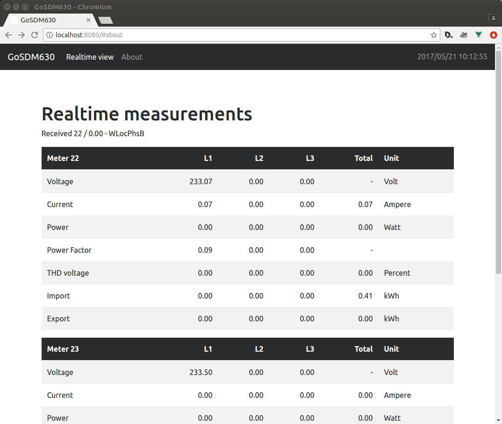
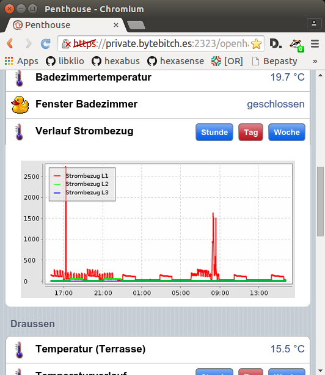

# ModBus Measurement Daemon

[](https://travis-ci.org/volkszaehler/mbmd)

A daemon for collecting measurement data from smart meters and grid inverters over modbus.

`mbmd` provides an http interface to smart meters and grid inverters with modbus interface.
Meter readings are made accessible through REST API and MQTT.
Modbus communication is possible over RS485 connections as well as TCP sockets.

`mbmd` was originally developer by Mathias Dalheimer under the name of `gosdm`. Previous releases are still [available](https://github.com/gonium/gosdm630).

# Table of Contents

* [Requirements](#requirements)
* [Installation](#installation)
  * [Raspberry Pi](#raspberry-pi)
  * [Detecting connected meters](#detecting-connected-meters)
* [API](#api)
  * [Rest API](#rest-api)
  * [Websocket API](#websocket-api)
  * [MQTT API](#mqtt-api)
* [Supported Devices](#supported-devices)
* [Releases](#releases)


## Requirements

You'll need:
* A supported Modbus/RTU smart meter OR an supported Modbus/TCP SunSpec-compatible grid inverter.
* In case of Modbus/RTU: A USB RS485 adapter. See [USB-ISO-RS485 project](https://github.com/gonium/usb-iso-rs485) for a home-grown adapter.
* Optionally an RS485 to Ethernet converter (see [SO discussion](https://stackoverflow.com/questions/59459877/is-rtu-over-tcp-a-spec-conforming-modbus-application))


## Installation

### Using the precompiled binaries

Precompiled release packages are [available](https://github.com/volkszaehler/mbmd/releases). Download the right package for the target platform and unzip.

### Building from source

`mbmd` is developed in [Go](http://golang.org). To build from source two steps are needed:

- use `make install` to install the build tools (make sure `$GOPATH/bin` is part of the path to make the installed tools accessible for the next step)
- then run `make build` which creates the `./mbmd` binary

To cross-build for a different archtecture (e.g. Raspberry Pi), use

    GOOS=linux GOARCH=arm GOARM=5 make build

### Running

To get help on the various command line options run

	mbmd -h

The full documentation is available in the [docs](docs/mbmd.md) folder.
A typical invocation looks like this:

    $ ./bin/mbmd run -a /dev/ttyUSB0 -d janitza:26,sdm:1
    2017/01/25 16:34:26 config: creating RTU connection via /dev/ttyUSB0 (9600baud, 8N1)
    2017/01/25 16:34:26 httpd: starting api at :8080

This call queries a Janitza B23 meter with ID 26 and an Eastron SDM
meter at ID 1. Not all devices are by default configured to use ID 1.
The default device IDs depend on the meter type and documented in the meter's manual.

To use RTU devices with RS485/Ethernet adapters, add the `--rtu` switch to configure `mbmd` to use the TCP connection with RTU data format:

	❯ ./bin/mbmd run -a rs485.fritz.box:23 --rtu -d sdm:1
	2020/01/02 10:43:53 mbmd unknown version (unknown commit)
	2020/01/02 10:43:53 config: creating RTU over TCP connection for rs485.fritz.box:23
	2020/01/02 10:43:53 initialized device SDM1.1: {SDM Eastron SDM meters   }
	2020/01/02 10:43:53 httpd: starting api at :8080

If you use the ``-v`` commandline switch you can see
modbus traffic and the current readings on the command line.  At
[http://localhost:8080](http://localhost:8080) you can see an embedded
web page that updates itself with the latest values:




### Run using Docker

Alternatively run `mbmd` using the Docker image:

	docker run -p 8080:8080 --device=/dev/ttyUSB0 volkszaehler/mbmd run -a /dev/ttyUSB0 -u 0.0.0.0:8080 -d sdm:1

To mount the config file into the docker container use `-v $(pwd)/mbmd.yaml:/etc/mbmd.yaml`.

## Raspberry Pi

Download the ARM package for usage with Raspberry Pi and copy the binary
into `/usr/local/bin`. The following sytemd unit can be used to
start `mbmd` as service (put this into a new file ``/etc/systemd/system/mbmd.service``):

    [Unit]
    Description=mbmd
    After=syslog.target
    After=network-online.target
    [Service]
    ExecStart=/usr/local/bin/mbmd run -a /dev/ttyAMA0
    Restart=always
    [Install]
    WantedBy=multi-user.target

You might need to adjust the ``-a`` parameter depending on where your
RS485 adapter is connected. Then, use

    systemctl start mbmd

to test your installation. If you're satisfied use

    systemctl enable mbmd

to start the service at boot time automatically.

*WARNING:* When using an FTDI-based USB-RS485 adaptor the
Raspberry Pi might become unreachable after a while. This is most likely not
an issue with the RS485-USB adaptor or this software, but because of [a
bug in the Raspberry Pi kernel](https://github.com/raspberrypi/linux/issues/1187).
To fix switch the internal `dwc` USB hub of the Raspberry Pi to
USB1.1 by adding the following parameter to `/boot/cmdline.txt`:

    dwc_otg.speed=1


## Detecting connected meters

MODBUS/RTU does not provide a mechanism to discover devices. There is no
reliable way to detect all attached devices.
As workaround `mbmd scan` attempts to read the L1 voltage from all
device IDs and reports which one replied correctly (i.e. 110/230V +/-10%):

````
./mbmd scan -a /dev/ttyUSB0
2017/06/21 10:22:34 Starting bus scan
2017/06/21 10:22:35 Device 1: n/a
...
2017/07/27 16:16:39 Device 21: SDM type device found, L1 voltage: 234.86
2017/07/27 16:16:40 Device 22: n/a
2017/07/27 16:16:40 Device 23: n/a
2017/07/27 16:16:40 Device 24: n/a
2017/07/27 16:16:40 Device 25: n/a
2017/07/27 16:16:40 Device 26: Janitza type device found, L1 voltage: 235.10
...
2017/07/27 16:17:25 Device 247: n/a
2017/07/27 16:17:25 Found 2 active devices:
2017/07/27 16:17:25 * slave address 21: type SDM
2017/07/27 16:17:25 * slave address 26: type JANITZA
2017/07/27 16:17:25 WARNING: This lists only the devices that responded to a known L1 voltage request. Devices with different function code definitions might not be detected.
````


# API

## Rest API

`mbmd` provides a convenient REST API. Supported endpoints under `/api` are:

* `/api/last/{ID}` latest data for device
* `/api/avg/{ID}` averaged data over last minute
* `/api/status` daemon status

Both device APIs can also be called without the device id to return data for all connected devices.


### Monitoring

The `/api/status` endpoint provides the following information:

    $ curl http://localhost:8080/api/status
    {
      "StartTime": "2017-01-25T16:35:50.839829945+01:00",
      "UpTime": 65587.177092186,
      "Goroutines": 11,
      "Memory": {
        "Alloc": 1568344,
        "HeapAlloc": 1568344
      },
      "Modbus": {
        "TotalModbusRequests": 1979122,
        "ModbusRequestRatePerMinute": 1810.5264666764785,
        "TotalModbusErrors": 738,
        "ModbusErrorRatePerMinute": 0.6751319688261972
      },
      "ConfiguredMeters": [
        {
          "Id": 26,
          "Type": "JANITZA",
          "Status": "available"
        }
      ]
    }

This is a snapshot of a process running over night, along with the error
statistics during that timeframe. The process queries continuously,
the cabling is not a shielded, twisted wire but something that I had laying
around. With proper cabling the error rate should be lower, though.


## Websocket API

Data read from the meters can be observed by clients in realtime using the Websocket API.
As soon as new readings are available, they are pushed to connected websocket clients.

The websocket API is available on `/ws`. All connected clients receive status and
meter updates for all connected meters without further subscription.


## MQTT API

Another option for receiving client updates is by using the built-in MQTT publisher.
By default, readings are published at `/mbmd/<unique id>/<reading>`. Rate limiting is possible.


## Homie API

[Homie](https://homieiot.github.io) is an MQTT convention for IoT/M2M. `mbmd` publishes all devices and readings using the Homie protocol. This allows systems like e.g. OpenHAB to auto-discover devices operated by `mbmd`:



## InfluxDB support

There is also the option to directly insert the data into an influxdb database by using the command-line options available. InfluxDB 1.8 and 2.0 are currently supported. to enable this, add the `--influx-database` and the `--influx-url` commandline parameter. More advanced configuration is available, to learn more checkout the [mbmd_run.md](docs/mbmd_run.md) documentation

# Supported Devices

`mbmd` supports a range of DIN rail meters and grid inverters.

## Modbus RTU Meters

The meters have slightly different capabilities. The Eastron SDM630 offers
a lot of features, while the smaller devices only support basic features.
The table below gives an overview (please consult the manuals for definitive
guidance). The **Type** column is the identifier passed to `-d <Type>:<id>`
(case-insensitive).

Legend: `+` supported, `-` not available, `(+)` only one energy direction
(import *or* export) available per phase.

| Meter | Type | Phases | Voltage | Current | Power | Power Factor | Total Import | Total Export | Per-phase Import/Export | Line/Neutral THD |
|---|---|---|---|---|---|---|---|---|---|---|
| ABB A/B-Series | `ABB` | 3 | + | + | + | + | + | + | + | - |
| B+G e-tech DS100 | `DS100` | 3 | + | + | + | + | + | + | + | - |
| B+G e-tech WS100 | `WS100` | 1 | + | + | + | + | + | + | - | - |
| Bernecker (BE) MPM3PM | `MPM` | 3 | + | + | + | + | + | + | - | - |
| Carlo Gavazzi EM24 | `CGEM24` | 3 | + | + | + | + | + | + | (+) | - |
| Carlo Gavazzi EM24 E1 | `CGEM24_E1` | 3 | + | + | + | + | + | + | (+) | - |
| Carlo Gavazzi EM/ET 330/340 | `CGEX3X0` | 3 | + | + | + | + | + | + | (+) | - |
| Chint DTSU666 | `DTSU666` | 3 | + | + | + | + | + | + | + | - |
| DDM18SD | `DDM` | 1 | + | + | + | + | + | - | - | - |
| DZG DVH4013 | `DZG` | 3 | + | + | - | + | + | + | + | - |
| Eastron SDM54 | `SDM54` | 3 | + | + | + | + | + | + | + | + |
| Eastron SDM72 | `SDM72` | 3 | - | - | + | - | + | + | - | - |
| Eastron SDM72 v2 | `SDM72V2` | 3 | + | + | + | + | + | + | - | - |
| Eastron SDM120 | `SDM120` | 1 | + | + | + | + | + | + | - | - |
| Eastron SDM220 | `SDM220` | 1 | + | + | + | + | + | + | - | - |
| Eastron SDM230 | `SDM230` | 1 | + | + | + | + | + | + | - | - |
| Eastron SDM630 | `SDM` | 3 | + | + | + | + | + | + | + | + |
| Eastron SMART X96-1A | `X961A` | 3 | + | + | + | + | + | + | + | + |
| Eltako DSZ15DZMOD/DSZ16 | `ELTAKODSZ15` / `ELTAKODSZ16` | 3 | + | + | + | + | + | + | - | - |
| Finder 7M.24 | `FIND7M24` | 1 | + | + | + | + | + | + | - | + |
| Finder 7M.38 | `FIND7M38` | 3 | + | + | + | + | + | + | - | + |
| Inepro Pro 380 | `INEPRO` | 3 | + | + | + | + | + | + | + | - |
| Janitza B-Series | `JANITZA` | 3 | + | + | + | + | + | + | + | - |
| Lovato DMG610 | `DMG610` | 3 | + | + | + | - | + | + | + | + |
| ORNO WE-504 | `ORNO1P504` | 1 | + | + | + | + | + | - | - | - |
| ORNO WE-514/515 | `ORNO1p` | 1 | + | + | + | + | + | - | - | - |
| ORNO WE-516/517 | `ORNO3p` | 3 | + | + | + | + | + | + | + | - |
| ORNO WE-525/526 | `ORNO1p525` | 1 | + | + | + | + | + | + | - | - |
| Saia Burgess (SBC) ALE3 | `SBC` | 3 | + | + | + | + | + | + | - | - |
| Schneider Electric iEM3000 | `IEM3000` | 3 | + | + | + | - | + | + | (+) | - |
| Siemens PAC2200 | `PAC2200` | 3 | + | + | + | + | + | + | - | - |
| SolarEdge SE-MTR-3Y | `SEMTR` | 3 | + | + | + | + | + | + | + | - |
| Wago 879-30xx | `WAGO87930` | 3 | + | + | + | + | + | + | + | - |

- **B+G e-tech DS100**: Similarly capable as the SDM630 if not better, and very cheap in Germany (below 50€).
  It supports a higher baud rate than the SDM630, so measurements can be taken more often.
  There is also a MID version and a multi-tariff ("-30B") version
  ([manual](https://data.xn--stromzhler-v5a.eu/manuals/bg_ds100serie_de.pdf)).
- **B+G e-tech WS100**: Cheap and small (1TE), 1P MID meter.
- **Bernecker (BE) MPM3PM**: Compact (4TE) three phase meter.
- **Carlo Gavazzi EM24**: Compact (4TE), 3P meter with RS-485 interface.
- **Carlo Gavazzi EM24 E1**: Compact (4TE), 3P meter with Ethernet interface.
- **DZG DVH4013**: This meter does not provide raw phase power measurements
  and only aggregated import/export measurements. The meter is only
  partially implemented and not recommended.
  By default, the meter communicates using 9600 8E1. The meter ID
  is derived from the serial number taking the last two numbers of the
  serial number (top right of the device), e.g. 23, and add one (24).
  Assume this is a hexadecimal number and convert it to decimal (36). Use
  this as the meter ID.
- **Eastron SDM54**: Compact (3TE), 3P meter with a lot of features. Can be configured using the builtin display.
- **Eastron SDM72**: Compact (4TE), 3P meter with bare minimum of total measurements, no currents. Can be configured using the builtin display.
- **Eastron SDM120**: Cheap and small (1TE), but communication parameters can only be set over MODBUS, which is currently not supported by this project.
  You can use e.g. [SDM120C](https://github.com/gianfrdp/SDM120C) to change parameters.
- **Eastron SDM220/230**: More comfortable (2TE), can be configured using the builtin display.
- **Eastron SDM630**: v1 and v2, both MID and non-MID. Compact (4TE) and with lots
  of features. Can be configured for 1P2 (single phase with neutral), 3P3
  (three phase without neutral) and 3P4 (three phase with neutral) systems.
- **Eltako DSZ15DZMOD/DSZ16**: Bidirectional 3P MID meters with Modbus RTU. Voltage, current,
  power, power factor and total import/export energy are supported; the DSZ16's additional
  measurements (reactive/apparent power, frequency, per-phase energy) are not yet implemented
  ([Modbus spec](https://www.eltako.com/fileadmin/downloads/de/_bedienung/Modbus-RTU_protocol_specification_for_DSZ15DZMOD_V1.6_English_version.pdf)).
- **Inepro Pro 380**: Compact (4TE) MID meter with extensive features.
  Can be connected 3P4W, 3P3W and 1P2W. Includes per-direction active/reactive energy consumption and supports two tariffs. Energy resolution is 2 digits per kWh.
- **Janitza B-Series**: These meters have a higher update rate than the Eastron
  devices, but they are more expensive. The B23-312 variant is the one with a MODBUS interface.
- **ORNO WE-504/514/515**: Low cost single phase meter.
  By default, the meter communicates using 9600 8E1. The meter ID is 1. Meter ID, bus speed and other parameters are configurable via [Software (Windows only)](https://www.partner.orno.pl/grafiki2/PC%20softwre170621.rar).
  WE-515 has a lithium battery and multi-tariff support, WE-514 does not support tariff zones.
- **ORNO WE-516/517**: Low cost three phase meter.
  By default, the meter communicates using 9600 8E1. The meter ID is 1. Meter ID, bus speed and other parameters are configurable via [Software (Windows only)](https://www.partner.orno.pl/grafiki2/PC%20softwre170621.rar).
  WE-517 has a lithium battery and multi-tariff support, WE-516 does not support tariff zones.
- **Saia Burgess (SBC) ALE3**: This compact Saia Burgess Controls meter is comparable to the SDM630.
  It has two tariffs, both import and export depending on meter version and compact (4TE). It's often used with Viessmann heat pumps.
- **Schneider Electric iEM3000**: Professional meter with loads of configurable max/average measurements with timestamp functionality.

## Modbus TCP Grid Inverters

Apart from meters, SunSpec-compatible grid inverters connected over TCP
are supported, too. SunSpec defines a default register layout for accessing
the devices.

Supported inverters include popular devices from SolarEdge (SE3000, SE9000)
and SMA (Sunny Boy and Sunny TriPower).

In case of TCP connection, the adapter parameter becomes the hostname and port:

	./mbmd run -a 192.168.0.44:502 -d SMA:23

SunSpec devices can host multiple subdevices, e.g. to expose a meter attached to an inverter. To access a subdevice, append its id to the slave id:

	./mbmd run -a 192.168.0.44:502 -d FRONIUS:1.0 -d FRONIUS:1.1


# Releases

Download the lastest release from [github.com/volkszaehler/mbmd/releases](https://github.com/volkszaehler/mbmd/releases).
